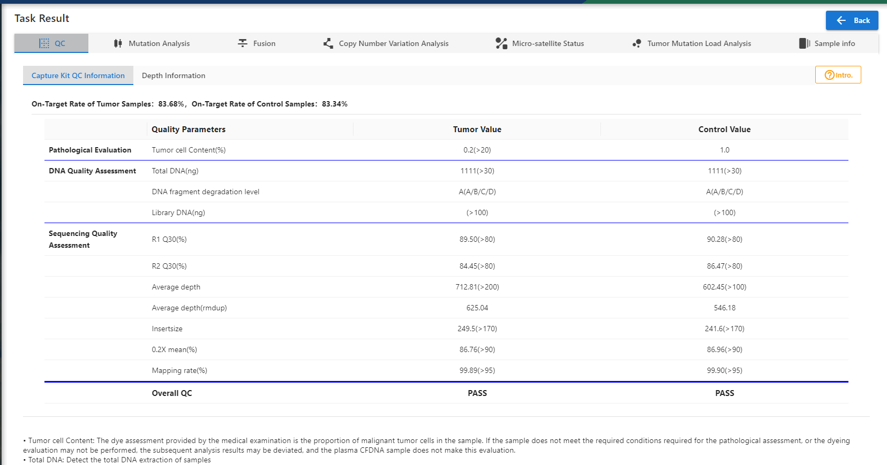
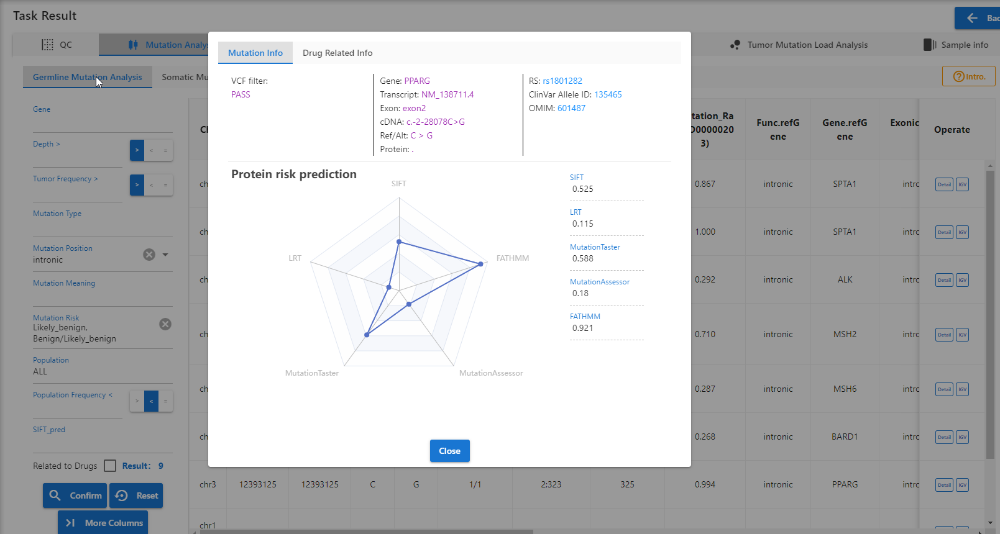
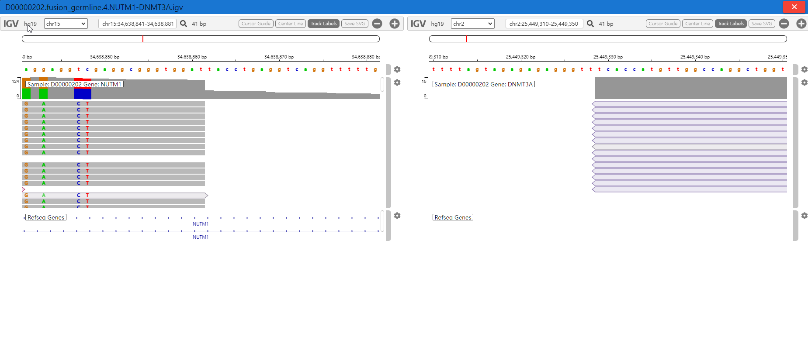
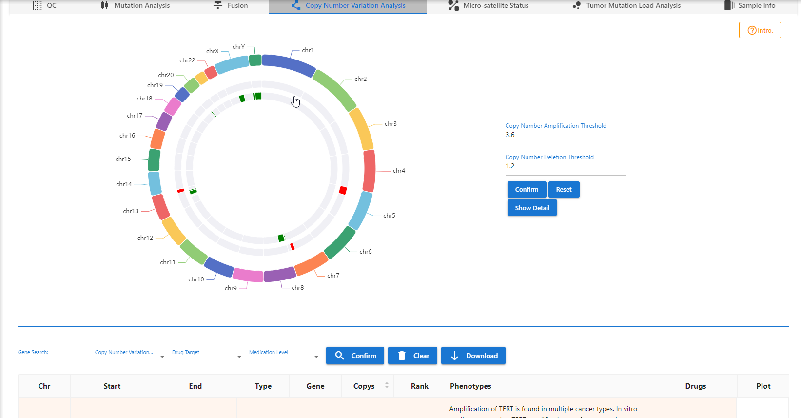
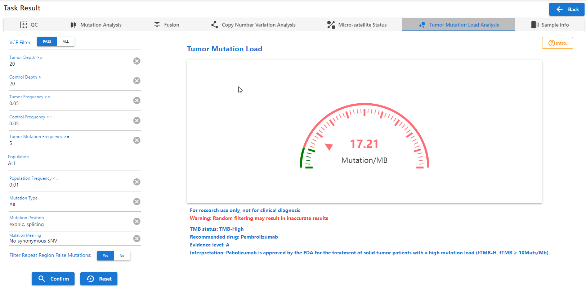

# Bioinfomatics Analysis System

## A Bioinfomatics Analysis Project for bio sample genome analysis
## Architecture
- [Vue3](https://cn.vuejs.org/)
- [Quasar](https://quasar.dev/) : The enterprise-ready cross-platform VueJs framework
- [Ant Design Vue](https://www.antdv.com/)
- [igv](https://github.com/igvteam/igv.js) : Integrative Genomics Viewer
- [Echarts](https://echarts.apache.org/en/index.html) : An Open Source JavaScript Visualization Library

## Features
- Platform Overview
- Project Management
- Task Management
  - Quality Control
  - Fusion
  - Copy Number Variation
  - Homologous Recombination Defect
  - Micro-satellite Instability
  - Mutation
  - Pathogen
  - Tumor Mutation Load
  - Common Analysis Module
- Custom Report
- Patient Management
- Sample Management
- Data Management
- Panel Flow Intra
- Genome Browser

## Demo snapshots







## Development Guide

```bash
yarn
# or
npm install
```

### Start the app in development mode (hot-code reloading, error reporting, etc.)

```bash
quasar dev
```

### Lint the files

```bash
yarn lint
# or
npm run lint
```

### Format the files

```bash
yarn format
# or
npm run format
```

### Build the app for production

```bash
quasar build
```

### Customize the configuration

See [Configuring quasar.config.js](https://v2.quasar.dev/quasar-cli-webpack/quasar-config-js).
